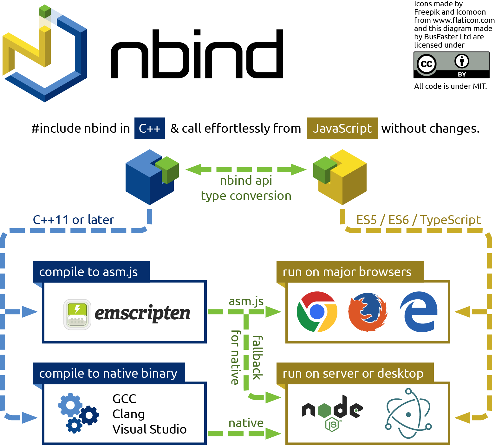

[Quick start](#quick-start) |
[Requirements](#requirements) |
[Features](#features) |
[User guide](#user-guide) |
[Contributing](#contributing) |
[License](#license)

[](doc/images/diagram.png)

`nbind` is a set of headers that make your C++11 library accessible from JavaScript.
With a single `#include` statement, your C++ compiler generates the necessary bindings
without any additional tools. Your library is then usable as a Node.js addon or,
if compiled to asm.js with [Emscripten](http://emscripten.org),
directly in web pages without any plugins.

`nbind` works with the [autogypi](https://github.com/charto/autogypi) dependency management tool,
which sets up `node-gyp` to compile your library without needing any configuration
(other than listing your source code file names).

`nbind` is **MIT licensed** and based on templates and macros inspired by
[embind](http://kripken.github.io/emscripten-site/docs/porting/connecting_cpp_and_javascript/embind.html).

Quick start
===========

C++ everywhere in 5 easy steps using Node.js, `nbind` and [autogypi](https://github.com/charto/autogypi):

<table>
<tr>
	<th>Starting point</th>
	<th>Step 1 - bind</th>
	<th>Step 2 - prepare</th>
</tr><tr>
<td valign="top">Original C++ code <a href="https://raw.githubusercontent.com/charto/nbind-example-minimal/master/hello.cc"><code>hello.cc</code></a>:<br>
<pre>#include &lt;string&gt;
#include &lt;iostream&gt;
&nbsp;
struct Greeter {
  static void sayHello(
    std::string name
  ) {
    std::cout
      &lt;&lt; "Hello, "
      &lt;&lt; name &lt;&lt; "!\n";
  }
};</pre></td>
<td valign="top">List your <a href="#classes-and-constructors">classes</a> and <a href="#methods-and-properties">methods</a>:<br>
<pre>// Your original code here
&nbsp;
// Add these below it:
&nbsp;
#include "nbind/nbind.h"
&nbsp;
NBIND_CLASS(Greeter) {
  method(sayHello);
}</pre></td>
<td valign="top"><a href="#creating-your-project">Add scripts</a> to <a href="https://raw.githubusercontent.com/charto/nbind-example-minimal/master/package.json"><code>package.json</code></a>:<br>
<pre>{
  "scripts": {
    "autogypi": "autogypi",
    "node-gyp": "node-gyp",
    "emcc-path": "emcc-path",
    "copyasm": "copyasm",
    "ndts": "ndts"
  }
}</pre></td>
</tr><tr>
	<th>Step 3 - install</th>
	<th>Step 4 - build</th>
	<th>Step 5 - use!</th>
</tr><tr>
<td valign="top">Run on the command line:<br>
<pre>npm install --save \
  nbind autogypi node-gyp
&nbsp;
npm run -- autogypi \
  --init-gyp \
  -p nbind -s hello.cc</pre></td>
<td valign="top">Compile to native binary:<br>
<pre>npm run -- node-gyp \
  configure build</pre>
Or to Asm.js:<br>
<pre>npm run -- node-gyp \
  configure build \
  --asmjs=1</pre></td>
<td valign="top">Call from Node.js:<br>
<pre>var nbind = require('nbind');
var lib = nbind.init().lib;
&nbsp;
lib.Greeter.sayHello('you');</pre>
Or from a web browser (<a href="#using-in-web-browsers">see below</a>).
</td></tr>
</table>

The above is **all** of the required code. Just copy and paste in the mentioned files and prompts or take a shortcut:

```bash
git clone https://github.com/charto/nbind-example-minimal.git
cd nbind-example-minimal
npm install && npm test
```

See it run!

(Note: [nbind-example-universal](https://github.com/charto/nbind-example-universal)
is a better starting point for development)

Requirements
============

You need:

- [Node.js](https://nodejs.org/en/) 0.10.x - 7.x.x (newer may also work).
- Python 2.7, NOT 3.x (required by `node-gyp`, [see instructions](https://github.com/nodejs/node-gyp#installation)).

And one of the following C++ compilers:

- GCC 4.8 or above.
- Clang 3.6 or above.
- Emscripten 1.35.0 or above.
- Visual Studio 2015 ([the Community version](https://www.visualstudio.com/en-us/products/visual-studio-community-vs.aspx) is fine).

Features
========

`nbind` allows you to:

- Use your C++ API from JavaScript without any extra effort.
  - From **Node.js**, **Electron** and web browsers (using asm.js on **Chrome**, **Firefox** and **Edge**).
  - On Linux, OS X and Windows.
  - Without changes to your C++ code. Simply add a separate short description at the end.
- Distribute both **native** code and an **asm.js** fallback binary.
- Automatically generate TypeScript `.d.ts` definition files from C++ code for IDE autocompletion and compile-time checks of JavaScript side code.

In more detail:

- Export multiple C++ classes, even ones not visible from other files.
- Export C++ methods simply by mentioning their names.
- Auto-detect argument and return types from C++ declarations.
- [Automatically convert types](#type-conversion) and data structures between languages.
- Call C++ methods from JavaScript with type checking.
- Pass JavaScript callbacks to C++ and call them with any types.
- Pass instances of compatible classes by value between languages (through the C++ stack).

The goal is to provide a **stable API** for binding C++ to JavaScript.
All internals related to JavaScript engines are hidden away,
and a single API already supports *extremely* different platforms.

Works on your platform
----------------------

<table>
	<tr>
		<th>Target</th>
		<th colspan=2>Development platform</th>
	</tr><tr>
		<th></th>
		<th>Linux / OS X</th>
		<th>Windows</th>
	</tr><tr>
		<td>Native</td>
		<td>
			<a href="http://travis-ci.org/charto/nbind">
				
			</a>
		</td>
		<td>
			<a href="https://ci.appveyor.com/project/jjrv/nbind/branch/master">
				
			</a>
		</td>
	</tr><tr>
		<td>Asm.js</td>
		<td>
			<a href="http://travis-ci.org/charto/nbind-ci-emscripten">
				
			</a>
		</td>
		<td>Tested manually</td>
	</tr>
</table>

[](https://david-dm.org/charto/nbind)
[](https://www.npmjs.com/package/nbind)

Roadmap
-------

More is coming! Work is ongoing to:

- Precompile to a single native library for all versions Node.js and Electron on the same platform
  - Precompiled addons for different Node.js versions for efficiently calling the library will be provided with nbind
- Support native Android and iPhone apps.

Future `0.x.y` versions *should* remain completely backwards-compatible between matching `x` and otherwise with minor changes.
Breaking changes will be listed in release notes of versions where `y` equals `0`.

Contributing
============

Please report issues through Github and mention the platform you're targeting
(Node.js, asm.js, Electron or something else). Pull requests are very welcome.

Warning: rebase is used within develop and feature branches (but not master).

When developing new features, writing tests first works best.
If possible, please try to get them working on both Node.js and asm.js.
Otherwise your pull request will get merged to Master only after
maintainer(s) have fixed the other platform.

Installing Emscripten to develop for asm.js can be tricky. It will require
Python 2.7 and setting paths correctly, please refer to
[Emscripten documentation](https://kripken.github.io/emscripten-site/docs/getting_started/downloads.html).
The `bin/emcc` script in this package is just a wrapper,
the actual `emcc` compiler binary should be in your path.

You can rebuild the asm.js library and run tests as follows:

```bash
npm run clean-asm && npm run prepublish && npm run test-asm
```

User guide
==========

- [Installing the examples](#installing-the-examples)
- [Creating your project](#creating-your-project)
- [Configuration](#configuration)
- [Calling from Node.js](#calling-from-nodejs)
- [Using nbind headers](#using-nbind-headers)
- [Functions](#functions)
- [Classes and constructors](#classes-and-constructors)
- [Inheritance](#inheritance) <sup>new in 0.3.5</sup>
- [Methods and properties](#methods-and-properties)
- [Overloaded functions](#overloaded-functions) <sup>new in 0.3.2</sup>
- [Getters and setters](#getters-and-setters)
- [Passing data structures](#passing-data-structures)
- [Callbacks](#callbacks)
- [Using objects](#using-objects)
- [Type conversion](#type-conversion) <sup>updated in 0.3.2</sup>
- [Buffers](#buffers) <sup>new in 0.3.1</sup>
- [64-bit integers](#64-bit-integers) <sup>new in 0.3.0</sup>
- [Error handling](#error-handling)
- [Publishing on npm](#publishing-on-npm)
- [Shipping an asm.js fallback](#shipping-an-asmjs-fallback)
- [Using in web browsers](#using-in-web-browsers) <sup>updated in 0.3.0</sup>
- [Using with TypeScript](#using-with-typescript) <sup>updated in 0.3.5</sup>
- [Binding plain C](#binding-plain-c)
- [Binding external libraries](#binding-external-libraries)
- [Debugging](#debugging)
- [Alternatives](#alternatives)

Installing the examples
-----------------------

`nbind` examples shown in this user guide are also available to download
for easier testing as follows:

Extract [this zip package](https://github.com/charto/nbind-examples/archive/master.zip) or run:

```bash
git clone https://github.com/charto/nbind-examples.git
```

Enter the examples directory and install:

```bash
cd nbind-examples
npm install
```

Creating your project
---------------------

Once you have all [requirements](#requirements) installed, run:

```bash
npm init
npm install --save nbind autogypi node-gyp
```

`nbind`, `autogypi` and `node-gyp` are all needed to compile
a native Node.js addon from source when installing it.
If you only distribute an asm.js version, you can use
`--save-dev` instead of `--save` because users won't need to compile it.

Next, to run commands without installing them globally, it's practical
to add them in the `scripts` section of your `package.json` that `npm init`
just generated. Let's add an install script as well:

```json
  "scripts": {
    "autogypi": "autogypi",
    "node-gyp": "node-gyp",
    "emcc-path": "emcc-path",
    "copyasm": "copyasm",

    "install": "autogypi && node-gyp configure build"
  }
```

`emcc-path` is needed internally by `nbind` when compiling for asm.js.
It fixes some command line options that `node-gypi` generates on OS X
and the Emscripten compiler doesn't like.
You can leave it out if only compiling native addons.

The `install` script runs when anyone installs your package.
It calls `autogypi` and then uses `node-gyp` to compile a native addon.

`autogypi` uses npm package information to set correct include paths
for C/C++ compilers. It's needed when distributing addons on npm
so the compiler can find header files from the `nbind` and `nan` packages
installed on the user's machine. Initialize it like this:

```bash
npm run -- autogypi --init-gyp -p nbind -s hello.cc
```

Replace `hello.cc` with the name of your C++ source file.
You can add multiple `-s` options, one for each source file.

The `-p nbind` means the C++ code uses `nbind`. Multiple `-p`
options can be added to add any other packages compatible with `autogypi`.

The `--init-gyp` command generates files `binding.gyp` and `autogypi.json`
that you should distribute with your package, so that `autogypi` and `node-gyp`
will know what to do when the `install` script runs.

Now you're ready to start writing code and compiling.

Configuration
-------------

Refer to [autogypi documentation](https://github.com/charto/autogypi#readme)
to set up dependencies of your package, and how other packages
should include it if it's a library usable directly from C++.

`--asmjs=1` is the only existing configuration option for `nbind` itself.
You pass it to `node-gyp` by calling it like `node-gyp configure build --asmjs=1`.
It compiles your package using Emscripten instead of your default C++ compiler
and produces asm.js output.

Calling from Node.js
--------------------

First `nbind` needs to be initialized by calling `nbind.init` which takes
the following optional arguments:

- Base path under which to look for compiled binaries.
  Default is `process.cwd()` and `__dirname` is a good alternative.
- Binary code exports object. Any classes from C++ API exported using `nbind`
  will be added as members. Default is an empty object.
  Any existing options will be seen by asm.js code and can be used to
  [configure Emscripten output](https://kripken.github.io/emscripten-site/docs/api_reference/module.html).
  Must follow base path (which may be set to `null` or `undefined`).
- Node-style callback with 2 parameters:
  - Error if present, otherwise `null`.
  - Binary code exports object containing C++ classes.

`nbind` can be initialized synchronously on Node.js and asynchronously on
browsers and Node.js. Purely synchronous is easier but not as future-proof:

```JavaScript
var nbind = require('nbind');
var lib = nbind.init().lib;

// Use the library.
```

Using a callback also supports asynchronous initialization:

```JavaScript
var nbind = require('nbind');

nbind.init(function(err, binding) {
  var lib = binding.lib;

  // Use the library.
});
```

The callback passed to init currently gets called synchronously in Node.js
and asynchronously in browsers. To avoid releasing
[zalgo](http://blog.izs.me/post/59142742143/designing-apis-for-asynchrony)
you can for example wrap the call in a
[bluebird](http://bluebirdjs.com/docs/api/promise.promisify.html) promise:

```JavaScript
var bluebird = require('bluebird');
var nbind = require('nbind');

bluebird.promisify(nbind.init)().then(function(binding) {
  var lib = binding.lib;

  // Use the library.
});
```

Using nbind headers
-------------------

There are two possible files to include:

- `nbind/api.h` for using types from the `nbind` namespace such as JavaScript callbacks inside your C++ code.
  - `#include` **before** your own class definitions.
  - Causes your code to depend on `nbind`.
- `nbind/nbind.h` for exposing your C++ API to JavaScript.
  - `#include` **after** your own class definitions to avoid accidentally invoking its macros.
  - The header automatically hides itself if not targeting Node.js or asm.js.
  - Safe to use in any projects.

Use `#include "nbind/nbind.h"` at the end of your source file with only the bindings after it.
The header defines macros with names like `construct` and `method` that may otherwise break
your code or conflict with other headers.

It's OK to include `nbind/nbind.h` also when not targeting any JavaScript environment.
`node-gyp` defines a `BUILDING_NODE_EXTENSION` macro and Emscripten defines an `EMSCRIPTEN` macro
so when those are undefined, the include file does nothing.

Use `#include "nbind/api.h"` in your header files to use types in the nbind namespace
if you need to [report errors](#error-handling) without throwing exceptions,
or want to pass around [callbacks](#callbacks) or [objects](#using-objects).

You can use an `#ifdef NBIND_CLASS` guard to skip your `nbind` export definitions when the headers weren't loaded.

Example that uses an `nbind` callback in C++ code:

**[`1-headers.cc`](https://raw.githubusercontent.com/charto/nbind-examples/master/1-headers.cc)**

```C++
#include <string>
#include <iostream>

// For nbind::cbFunction type.
#include "nbind/api.h"

class HeaderExample {

public:

  static void callJS(nbind::cbFunction &callback) {
    std::cout << "JS says: " << callback.call<std::string>(1, 2, 3);
  }

};

// For NBIND_CLASS() and method() macros.
#include "nbind/nbind.h"

#ifdef NBIND_CLASS

NBIND_CLASS(HeaderExample) {
  method(callJS);
}

#endif
```

Example used from JavaScript:

**[`1-headers.js`](https://raw.githubusercontent.com/charto/nbind-examples/master/1-headers.js)**

```JavaScript
var nbind = require('nbind');

var lib = nbind.init().lib;

lib.HeaderExample.callJS(function(a, b, c) {
  return('sum = ' + (a + b + c) + '\n');
});
```

Run the example with `node 1-headers.js` after [installing](#installing-the-examples). It prints:

```
JS says: sum = 6
```

Functions
---------

Functions not belonging to any class are exported inside an `NBIND_GLOBAL`
block with a macro call `function(functionName);` which takes the name of
the function as an argument (without any quotation marks).
The C++ function gets exported to JavaScript with the same name,
or it can be renamed by adding a second argument (with quotation marks):
`function(cppFunctionName, "jsExportedName");`

If the C++ function is overloaded, `multifunction` macro must be used
instead. See [overloaded functions](#overloaded-functions).

Note: you cannot put several `function(...);` calls on the same line!
Otherwise you'll get an error about redefining a symbol.

Example:

**[`6-functions.cc`](https://raw.githubusercontent.com/charto/nbind-examples/master/6-functions.cc)**

```C++
#include <iostream>

void sayHello(std::string name) {
  std::cout << "Hello, " << name << "!\n";
}

#include "nbind/nbind.h"

NBIND_GLOBAL() {
  function(sayHello);
}
```

Example used from JavaScript:

**[`6-functions.js`](https://raw.githubusercontent.com/charto/nbind-examples/master/6-functions.js)**

```JavaScript
var nbind = require('nbind');
var lib = nbind.init().lib;

lib.sayHello('you');
```

Classes and constructors
------------------------

The `NBIND_CLASS(className)` macro takes the name of your C++ class as an argument
(without any quotation marks), and exports it to JavaScript using the same name.
It's followed by a curly brace enclosed block of method exports,
as if it was a function definition.

The class can be renamed on the JavaScript side by passing a string as a
second argument. This is especially useful for binding a template class
specialization with a more reasonable name: `NBIND_CLASS(Data<int>, "IntData")`

Constructors are exported with a macro call `construct<types...>();` where `types` is a comma-separated list of arguments to the constructor, such as `int, int`. Calling `construct` multiple times allows overloading it, but **each overload must have a different number of arguments**.

Constructor arguments are the only types that `nbind` cannot detect automatically.

Example with different constructor argument counts and types:

**[`2-classes.cc`](https://raw.githubusercontent.com/charto/nbind-examples/master/2-classes.cc)**

```C++
#include <iostream>

class ClassExample {

public:

  ClassExample() {
    std::cout << "No arguments\n";
  }
  ClassExample(int a, int b) {
    std::cout << "Ints: " << a << " " << b << "\n";
  }
  ClassExample(const char *msg) {
    std::cout << "String: " << msg << "\n";
  }

};

#include "nbind/nbind.h"

NBIND_CLASS(ClassExample) {
  construct<>();
  construct<int, int>();
  construct<const char *>();
}
```

Example used from JavaScript:

**[`2-classes.js`](https://raw.githubusercontent.com/charto/nbind-examples/master/2-classes.js)**

```JavaScript
var nbind = require('nbind');

var lib = nbind.init().lib;

var a = new lib.ClassExample();
var b = new lib.ClassExample(42, 54);
var c = new lib.ClassExample("Don't panic");
```

Run the example with `node 2-classes.js` after [installing](#installing-the-examples). It prints:

```
No arguments
Ints: 42 54
String: Don't panic
```

Inheritance
-----------

When a C++ class inherits another, the `inherit` macro can be used to allow calling parent
class methods on the child class, or passing child class instances to C++ methods expecting
parent class instances.

Internally JavaScript only has prototype-based single inheritance while C++ supports
multiple inheritance. To simulate it, nbind will use one parent class as the child class
prototype, and copy the contents of the other parents to the prototype. This has otherwise
the same effect, except the JavaScript `instanceof` operator will return `true` for only
one of the parent classes.

Example:

```JavaScript
NBIND_CLASS(Child) {
    inherit(FirstParent);
    inherit(SecondParent);
}
```

Methods and properties
----------------------

Methods are exported inside an `NBIND_CLASS` block with a macro call `method(methodName);`
which takes the name of the method as an argument (without any quotation marks).
The C++ method gets exported to JavaScript with the same name.

If the C++ method is overloaded, `multimethod` macro must be used instead.
See [overloaded functions](#overloaded-functions).

Properties should be accessed through [getter and setter functions](#getters-and-setters).

Data types of method arguments and its return value are detected automatically
so you don't have to specify them. Note the [supported data types](#type-conversion)
because using other types may cause compiler errors that are difficult to understand.

If the method is `static`, it becomes a property of the JavaScript constructor function
and can be accessed like `className.methodName()`. Otherwise it becomes a property of
the prototype and can be accessed like `obj = new className(); obj.methodName();`

Example with a method that counts a cumulative checksum of ASCII character values in strings,
and a static method that processes an entire array of strings:

**[`3-methods.cc`](https://raw.githubusercontent.com/charto/nbind-examples/master/3-methods.cc)**

```C++
#include <string>
#include <vector>

class MethodExample {

public:

  unsigned int add(std::string part) {
    for(char &c : part) sum += c;

    return(sum);
  }

  static std::vector<unsigned int> check(std::vector<std::string> list) {
    std::vector<unsigned int> result;
    MethodExample example;

    for(auto &&part : list) result.push_back(example.add(part));

    return(result);
  }

  unsigned int sum = 0;

};

#include "nbind/nbind.h"

NBIND_CLASS(MethodExample) {
  construct<>();

  method(add);
  method(check);
}
```

Example used from JavaScript, first calling a method in a loop from JS
and then a static method returning an array:

**[`3-methods.js`](https://raw.githubusercontent.com/charto/nbind-examples/master/3-methods.js)**

```JavaScript
var nbind = require('nbind');

var lib = nbind.init().lib;

var parts = ['foo', 'bar', 'quux'];

var checker = new lib.MethodExample();

console.log(parts.map(function(part) {
  return(checker.add(part));
}));

console.log(lib.MethodExample.check(parts));
```

Run the example with `node 3-methods.js` after [installing](#installing-the-examples). It prints:

```
[ 324, 633, 1100 ]
[ 324, 633, 1100 ]
```

The example serves to illustrate passing data.
In practice, such simple calculations are faster to do in JavaScript
rather than calling across languages because copying data is quite expensive.

Overloaded functions
--------------------

The `function()` and `method()` macroes cannot distinguish between several
overloaded versions of the same function or method, causing an error.
In this case the `multifunction()` and `multimethod()` macroes must be used.

Their second parameter is a list of argument types wrapped in an
`args()` macro to select a single overloaded version.

For example consider an overloaded method:

```C++
void test(unsigned int x) const;
void test(unsigned int x, unsigned int y) const;
```

In bindings, one of the versions needs to be explicitly selected.
The second of the two would be referenced like:

```C++
multimethod(test, args(unsigned int, unsigned int));
```

If it needs to be renamed, the call would be:

```C++
multimethod(test, args(unsigned int, unsigned int), "test2");
```

As always, the return type and method constness are autodetected.

Getters and setters
-------------------

Property getters are exported inside an `NBIND_CLASS` block with a macro call
`getter(getterName)` with the name of the getter method as an argument.
`nbind` automatically strips a `get`/`Get`/`get_`/`Get_` prefix and
converts the next letter to lowercase, so for example `getX` and `get_x`
both would become getters of `x` to be accessed like `obj.x`

Property setters are exported together with getters using a macro call
`getset(getterName, setterName)` which works much like `getter(getterName)` above.
Both `getterName` and `setterName` are mangled individually so
you can pair `getX` with `set_x` if you like.
From JavaScript, `++obj.x` would then call both of them to read and change the property.

Example class and property with a getter and setter:

**[`4-getset.cc`](https://raw.githubusercontent.com/charto/nbind-examples/master/4-getset.cc)**

```C++
class GetSetExample {

public:

  void setValue(int value) { this->value = value; }
  int getValue() { return(value); }

private:

  int value = 42;

};

#include "nbind/nbind.h"

NBIND_CLASS(GetSetExample) {
  construct<>();

  getset(getValue, setValue);
}
```

Example used from JavaScript:

**[`4-getset.js`](https://raw.githubusercontent.com/charto/nbind-examples/master/4-getset.js)**

```JavaScript
var nbind = require('nbind');

var lib = nbind.init().lib;

var obj = new lib.GetSetExample();

console.log(obj.value++); // 42
console.log(obj.value++); // 43
```

Run the example with `node 4-getset.js` after [installing](#installing-the-examples).

Passing data structures
-----------------------

`nbind` supports automatically converting between JavaScript arrays and C++
`std::vector` or `std::array` types. Just use them as arguments or return values
in C++ methods.

Note that data structures don't use the same memory layout in both languages,
so the data always gets copied which takes more time for more data.
For example the strings in an array of strings also get copied,
one character at a time. In asm.js data is copied twice, first to a temporary
space using a common format both languages can read and write.

Callbacks
---------

Callbacks can be passed to C++ methods by simply adding an argument of type
`nbind::cbFunction &` to their declaration.

They can be called with any number of any supported types without having to declare in any way what they accept.
The JavaScript code will receive the parameters as JavaScript variables to do with them as it pleases.

A callback argument `arg` can be called like `arg("foobar", 42);` in which case the return value is ignored.
If the return value is needed, the callback must be called like `arg.call<type>("foobar", 42);`
where type is the desired C++ type that the return value should be converted to.
This is because the C++ compiler cannot otherwise know what the callback might return.

Warning: while callbacks are currently passed by reference,
they're freed after the called C++ function returns!
That's intended for synchronous functions like `Array.map`
which calls a callback zero or more times and then returns.
For asynchronous functions like `setTimeout` which calls the callback after it has returned,
you need to copy the argument to a new `nbind::cbFunction` and store it somewhere.

Using objects
-------------

C++ objects can be passed to and from JavaScript using different
parameter and return types in C++ code:

- *by reference* using pointers or references (optionally `const`)
- *by value*

Note: currently passing objects by pointer on Node.js requires the class
to have a "copy constructor" initializing itself from a pointer.
This will probably be fixed later.

Returned pointers and references can be `const`, in which case calling their
non-const methods or passing them as non-const parameters will throw an error.
This prevents causing undefined behaviour corresponding to C++ code that
wouldn't even compile.

Using pointers and references is particularly:

- **dangerous** because the pointer may become invalid
  without JavaScript noticing it.
- **annoying** in asm.js because browsers give no access to the garbage collector,
  so memory may leak when pointers become garbage without C++ noticing it.
  Smart pointers are not supported until a workaround for this is implemented.

Passing data by value using *value objects* solves both issues.
They're based on a `toJS` function on the C++ side
and a `fromJS` function on the JavaScript side.
Both receive a callback as an argument, and calling it with any parameters
calls the constructor of the equivalent type in the other language.

The callback on the C++ side is of type `nbind::cbOutput`.
Value objects are passed through the C++ stack to and from the exported function.
`nbind` uses C++11 move semantics to avoid creating some additional copies on the way.

The equivalent JavaScript constructor must be registered on the JavaScript side
by calling `binding.bind('CppClassName', JSClassName)`
so that `nbind` knows which types to translate between each other.

Example with a class `Coord` used as a value object, and a class
`ObjectExample` which uses objects passed by values and references:

**[`5-objects.cc`](https://raw.githubusercontent.com/charto/nbind-examples/master/5-objects.cc)**

```C++
#include <iostream>

#include "nbind/api.h"

class Coord {

public:

  Coord(signed int x = 0, signed int y = 0) : x(x), y(y) {}
  explicit Coord(const Coord *other) : x(other->x), y(other->y) {}

  void toJS(nbind::cbOutput output) {
    output(x, y);
  }

  signed int getX() { std::cout << "Get X\n"; return(x); }
  signed int getY() { std::cout << "Get Y\n"; return(y); }

  void setX(signed int x) { this->x = x; }
  void setY(signed int y) { this->y = y; }

  signed int x, y;

};

class ObjectExample {

public:

  static void showByValue(Coord coord) {
    std::cout << "C++ value " << coord.x << ", " << coord.y << "\n";
  }

  static void showByRef(Coord *coord) {
    std::cout << "C++ ref " << coord->x << ", " << coord->y << "\n";
  }

  static Coord getValue() {
    return(Coord(12, 34));
  }

  static Coord *getRef() {
    static Coord coord(56, 78);
    return(&coord);
  }

};

#include "nbind/nbind.h"

NBIND_CLASS(Coord) {
  construct<>();
  construct<const Coord *>();
  construct<signed int, signed int>();

  getset(getX, setX);
  getset(getY, setY);
}

NBIND_CLASS(ObjectExample) {
  method(showByValue);
  method(showByRef);
  method(getValue);
  method(getRef);
}
```

Example used from JavaScript:

**[`5-objects.js`](https://raw.githubusercontent.com/charto/nbind-examples/master/5-objects.js)**

```JavaScript
var nbind = require('nbind');

var binding = nbind.init();
var lib = binding.lib;

function Coord(x, y) {
  this.x = x;
  this.y = y;
}

Coord.prototype.fromJS = function(output) {
  output(this.x, this.y);
}

Coord.prototype.show = function() {
  console.log('JS value ' + this.x + ', ' + this.y);
}

binding.bind('Coord', Coord);

var value1 = new Coord(123, 456);
var value2 = lib.ObjectExample.getValue();
var ref = lib.ObjectExample.getRef();

lib.ObjectExample.showByValue(value1);
lib.ObjectExample.showByValue(value2);
value1.show();
value2.show();

lib.ObjectExample.showByRef(ref);
console.log('JS ref ' + ref.x + ', ' + ref.y);
```

Run the example with `node 5-objects.js` after [installing](#installing-the-examples). It prints:

```
C++ value 123, 456
C++ value 12, 34
JS value 123, 456
JS value 12, 34
C++ ref 56, 78
Get X
Get Y
JS ref 56, 78
```

Type conversion
---------------

Parameters and return values of function calls between languages
are automatically converted between equivalent types:

| JavaScript | C++                                         |
| ---------- | ------------------------------------------- |
| number     | (`un`)`signed char`, `short`, `int`, `long` |
| number     | `float`, `double`                           |
| number or [bignum](#64-bit-integers) | (`un`)`signed long`, `long long` |
| boolean    | `bool`                                      |
| string     | `const` (`unsigned`) `char *`               |
| string     | `std::string`                               |
| Array      | `std::vector<type>`                         |
| Array      | `std::array<type, size>`                    |
| Function   | `nbind::cbFunction`<br>(only as a parameter)<br>See [Callbacks](#callbacks) |
| nbind-wrapped pointer | Pointer or reference to an<br>instance of any bound class<br>See [Using objects](#using-objects) |
| Instance of any prototype<br>(with a fromJS method) | Instance of any bound class<br>(with a toJS method)<br>See [Using objects](#using-objects) |
| ArrayBuffer(View), Int*Array<br>or Buffer | `nbind::Buffer` struct<br>(data pointer and length)<br>See [Buffers](#buffers) |

Type conversion is customizable by passing policies as additional arguments
to `construct`, `function` or `method` inside an `NBIND_CLASS` or `NBIND_GLOBAL` block.
Currently supported policies are:

- `nbind::Nullable()` allows passing `null` as an argument when a C++ class instance is expected.
  The C++ function will then receive a `nullptr`.
- `nbind::Strict()` enables stricter type checking.
  Normally anything in JavaScript can be converted to `number`, `string` or `boolean` when expected by a C++ function.
  This policy requires passing the exact JavaScript type instead.

Type conversion policies are listed after the method or function names, for example:

```C++
NBIND_CLASS(Reference) {
    method(reticulateSplines, "reticulate", nbind::Nullable());
    method(printString, nbind::Strict());
}
```

Buffers
-------

Transferring large chunks of data between languages is fastest using typed arrays or Node.js buffers in JavaScript.
Both are accessible from C++ as plain blocks of memory if passed in through the `nbind::Buffer` data type which has the methods:

- `data()` returns an `unsigned char *` pointing to a block of memory also seen by JavaScript.
- `length()` returns the length of the block in bytes.
- `commit()` copies data from C++ back to JavaScript (only needed with Emscripten).

This is especially useful for passing `canvas.getContext('2d').getImageData(...).data` to C++
and drawing to an on-screen bitmap when targeting Emscripten or Electron.

Example:

```C++
#include "nbind/api.h"

void range(nbind::Buffer buf) {
  size_t length = buf.length();
  unsigned char *data = buf.data();

  if(!data || !length) return;

  for(size_t pos = 0; pos < length; ++pos) {
    data[pos] = pos;
  }

  buf.commit();
}

#include "nbind/nbind.h"

NBIND_GLOBAL() {
  function(range);
}
```

Example used from JavaScript:

```JavaScript
var nbind = require('nbind');
var lib = nbind.init().lib;

var data = new Uint8Array(16);
lib.range(data);

console.log(data.join(' '));
```

It prints:

```
0 1 2 3 4 5 6 7 8 9 10 11 12 13 14 15
```

64-bit integers
---------------

Normally C++ 64-bit integer types are first converted to `double` and then to JavaScript number
which can only hold 53 bits of precision, but it's possible to preserve all bits by using a bignum class.
It should have a constructor taking the following arguments:

- Integer containing 32 bits from the least important half.
- Integer containing 32 bits from the most important half.
- Boolean, true if the number is negative.

It should also have a `fromJS` function which takes a callback,
and calls it with those same arguments to pass the data back to C++ when needed.

An example implementation also capable of printing 64-bit numbers to strings
in bases 2, 4, 10 and 16 is [included](https://raw.githubusercontent.com/charto/nbind/master/src/int64.ts).

Error handling
--------------

You can use the `NBIND_ERR("message here");` macro to report an error before returning from C++
(`#include "nbind/api.h"` first). It will be thrown as an error on the JavaScript side
(C++ environments like Emscripten may not support throwing exceptions, but the JavaScript side will).

Publishing on npm
-----------------

Make sure your `package.json` file has at least the required `emcc-path`
and `install` scripts:

```json
  "scripts": {
    "emcc-path": "emcc-path",

    "install": "autogypi && node-gyp configure build"
  }
```

The `dependencies` section should have at least:

```json
  "dependencies": {
    "autogypi": "^0.2.2",
	"nbind": "^0.2.1",
    "node-gyp": "^3.3.1"
  }
```

Your package should also include `binding.gyp` and `autogypi.json` files.

Shipping an asm.js fallback
---------------------------

[nbind-example-universal](https://github.com/charto/nbind-example-universal)
is a good minimal example of compiling a native Node.js addon if possible,
and otherwise using a pre-compiled asm.js version.

It has two temporary build directories `build/native` and `build/asmjs`,
for compiling both versions. `nbind` provides a binary `copyasm`
that can then be used to copy the compiled asm.js library
into a nicer location for publishing inside the final npm package.

Note that the native version should be compiled in the `install` script
so it runs for all users of the package, and the asm.js version should be
compiled in the `prepublish` script so it gets packaged in npm for usage
without the Emscripten compiler. See the
[example `package.json` file](https://github.com/charto/nbind-example-universal/blob/master/package.json).

Using in web browsers
---------------------

[nbind-example-universal](https://github.com/charto/nbind-example-universal)
is a good minimal example also of calling compiled asm.js code from inside
web browsers. The simplest way to get `nbind` working is to add
these scripts in your HTML code as seen in the
[example `index.html`](https://github.com/charto/nbind-example-universal/blob/master/public/index.html):

```html
<script src="nbind.js"></script>

<script>
  nbind.init(function(err, binding) {
    var lib = binding.lib;

    // Use the library.
  });
</script>
```

Make sure to fix the path to `nbind.js` on the first line if necessary.

Using with TypeScript
---------------------

`nbind` has a fully typed API for interacting with C++ code and it can also
automatically generate `.d.ts` files for your C++ classes and functions.
This gives you effortless bindings with compile time type checking for calls
from JavaScript to Node.js addons and asm.js modules.

All you have to do is compile your C++ code and run the included `ndts` tool
to create the type definitions:

```bash
npm run -- node-gyp configure build
npm run -s -- ndts . > lib-types.d.ts
```

When run in this way, the first argument of `ndts` is a path from the package
root to the `binding.gyp` file. Typically the file is in the root so the
correct path is `.`

Now you can load the C++ code from TypeScript in three different ways. First
import `nbind` (which also loads the C++ code) and types generated by `ndts`:

```TypeScript
import * as nbind from 'nbind';
import * as LibTypes from './lib-types';
```

Then choose your favorite way to initialize it:

Purely synchronous:

```TypeScript
const lib = nbind.init<typeof LibTypes>().lib;

// Use the library.
```

Asynchronous-aware:

```TypeScript
nbind.init((err: any, binding: nbind.Binding<typeof LibTypes>) => {
  const lib = binding.lib;

  // Use the library.
});
```

Promise-based:

```TypeScript
import * as bluebird from 'bluebird';

bluebird.promisify(nbind.init)().then((binding: nbind.Binding<typeof LibTypes>) => {
  const lib = binding.lib;

  // Use the library.
});
```

Note how there is a type argument `<typeof LibTypes>` for the init call
in all of the examples. It defines types of `binding.lib` contents, which
coming from C++ are otherwise unknown to the TypeScript compiler.
You can import the types from a file generated by `ndts` or just use `<any>`
to disable typing.

For example if you have a C++ class:

```C++
struct C : public A, public B {
    A *getA();

    static uint32_t reticulate();
};
```

And bind it like:

```C++
NBIND_CLASS(C) {
    inherit(A);
    inherit(B);

    construct<>();

    method(reticulate);

    getter(getA);
}
```

`ndts` will generate the following typings:

```TypeScript
export interface _C extends A, B {}
export var _C: { new(): _C };

export class C extends _C {
    /** C(); */
    constructor();

    /** static uint32_t reticulate(); */
    static reticulate(): number;

    /** A * a; -- Read-only */
    a: A;
}
```

The additional interface `_C` is generated in this case to support multiple
inheritance, because `C` extends both `A` and `B`.

All the [tests](https://github.com/charto/nbind/blob/master/test/test.ts)
are written in TypeScript so if you run:

```bash
git clone https://github.com/charto/nbind.git
cd nbind
npm install
npm test
```

You can then open `test/test.ts` in a TypeScript IDE and see the generated
typings in action.

Binding plain C
---------------

nbind generates bindings using C++ templates for compile-time introspection
of argument and return types of functions and methods.

Since plain C doesn't have templates, there's no standard way to have a
C compiler generate new wrapper code for type conversion and output type
information available at run-time.

The easiest way to use nbind with C is to write a C++ wrapper calling
the C code, and use nbind with that.

Mapping idiomatic C to JavaScript classes may require some manual work,
since it's common to reinvent new ways to do object-oriented programming,
usually by using structs as classes and simulating methods by passing struct
pointers to functions. C++ classes and methods should be used for these.

A good example is [libui-node](https://github.com/parro-it/libui-node) which
uses nbind to generate bindings for [libui](https://github.com/andlabs/libui),
mainly a C library.

Binding external libraries
--------------------------

If you have external library source code, you should compile it separately
into a library first, and then link your Node.js addon with it. If the
library has an installation script and the addon is only intended for your
own use or other users are willing to do some extra steps, it's easiest to
install the library globally first.

For best user experience, [libui-node](https://github.com/parro-it/libui-node)
is an example of distributing an external library together with your package.

For creating the actual bindings, see for example
[this](https://github.com/charto/nbind/issues/35#issuecomment-259480287) and
[this](https://github.com/charto/nbind/issues/35#issuecomment-260106802)
message and [a tutorial](https://github.com/charto/nbind/blob/master/doc/vg-tutorial.md)
for getting the [`vg`](https://github.com/vgteam/vg) library working.

Debugging
---------

In the browser it can be difficult to stop and debug at the correct spot in
optimized C++ code. `nbind` provides an `_nbind_debug()` function in `api.h`
that you can call from C++ to invoke the browser's debugger when using asm.js.

For debugging a Node.js addon, if you would normally test it like
`node test.js`, you can instead use `gdb node` and type `run test.js` in the
GDB prompt. Then in case of a crash, it will show where it happened,
inspect the stack etc.

You should also modify `nbind.gypi` (inside nbind's `src` directory)
and possibly your own `binding.gyp`, to remove any `-O?` flags and instead
add a `-g` flag, then remove the `build` directory and recompile.
This allows GDB to show much more information.

Alternatives
------------

Very similar:

- [Embind](https://kripken.github.io/emscripten-site/docs/porting/connecting_cpp_and_javascript/embind.html)
- [v8pp](https://github.com/pmed/v8pp)

Less similar:

- [libembindcefv8](https://github.com/gogoprog/libembindcefv8)
- [node-ffi](https://github.com/node-ffi/node-ffi)
- [cbind](https://github.com/encharm/node-cbind)
- [cpgf](https://github.com/cpgf/cpgf)
- [n2o](https://github.com/agnat/n2o)

Authors
=======

- Juha Järvi, befunge

License
=======

[The MIT License](https://raw.githubusercontent.com/charto/nbind/master/LICENSE)

Copyright (c) 2014-2017 BusFaster Ltd
